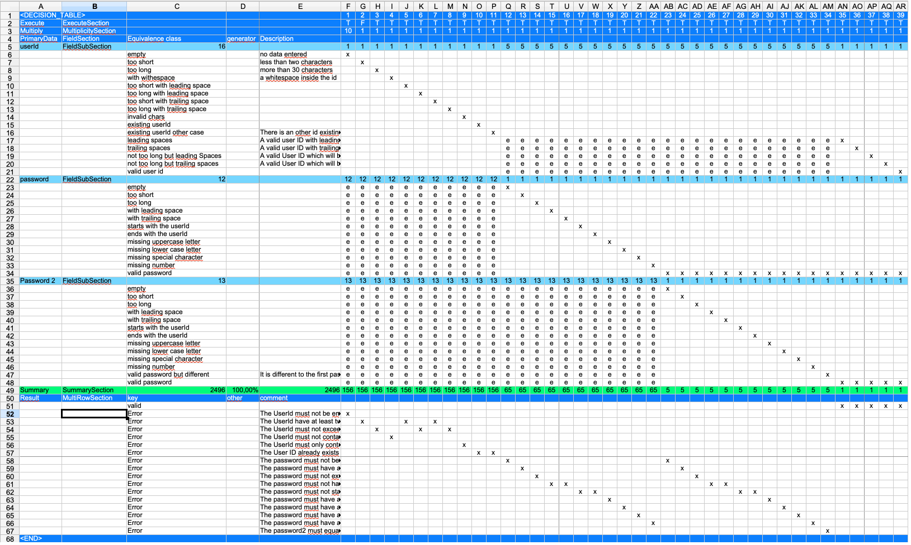
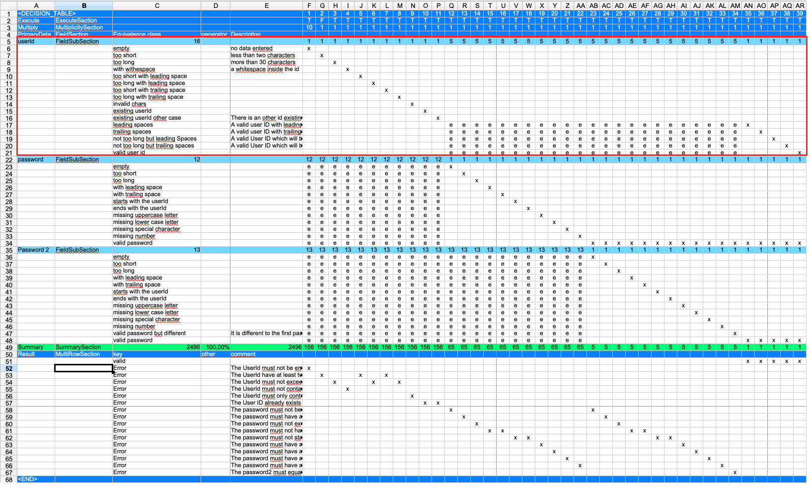

== Decision Table / Equivalence Class Table

=== In software testing

The decision table is also called equivalence class table is a technique to reduce the amount of test cases.
With the the software tester defines the 100% coverage. And then starts reducing the test cases to the needed
amount.

It also helps to show the stakeholders what kind of tests are executed and why.

=== For development
It is also useful for software developer to help them understand the rules to be implemented for an application.

=== How does it work

.Example table

This image shows an example for an equivalence class table. The table
is divided in a few sections. This example shows a table for a payment GUI.

.Test case side
image::images/model-decision/table_testcases.jpg[]

The right side shows the test cases. Each column on the right side is one
test case.

.The field description
image::images/model-decision/table_fields.jpg[]

The left side of the table describes the fields. And the expected result.

.Field section
image::images/model-decision/table_field_sections.jpg[]

On the left side there are two ''field sections'' The most tables have two field sections.
The secondary data section and the primary data section. The primary data is the data
which will directly be manipulated in the test. The secondary data is the data constellation
needed by this test.

For example we would like to test a payment where we exceed the day limit. Then we need to specify
secondary data which sets the day limit for a payment.

Each field section is divided in sub sections. For the payment example there is one sub section
for each field on the UI.

The field sections describes the variety of data needed by the test. And so the amount of tests
to be created.

.Field sub section

A sub section in this case is one field and all the equivalence classes for this field.
An equivalence class defines the different kind of field values with an equivalent behaviour.

For example the is a field with a maximum length of 10. Then all values entered with more then
10 chars will lead to an equivalent behaviour of the application. So it is not necessary
to test with 11, 12, 13, ... characters. The equivalent class is 'more than 10 chars'

.Multi row section
image::images/model-decision/table_multi_row_section.jpg[]

These sections could be used to describe the expected results or error messages. It is free to the user
how many of these sections he would like to add.
