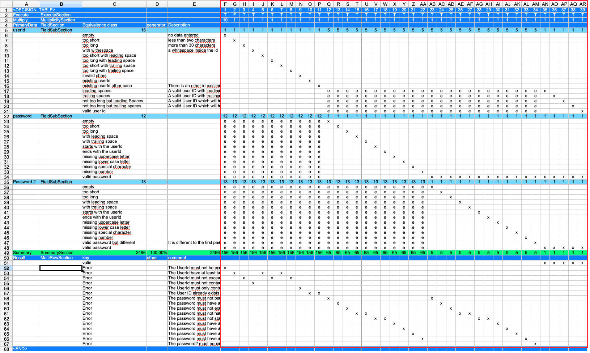

== Layout Equivalence Class Table

.Example table
image::images/model-decision/table.jpg[]

The example above shows an equivalence class table where the column order is crucial. The first five columns are fixed, and test cases begin from the sixth column onward. The parser determines the end of test cases by reading the first row and stopping at the first empty cell. Therefore, inserting an empty column within the test case area will cause the parser to stop processing further columns.

The table is divided into several sections:

.Test case side

On the right side of the table, each column represents one test case. The column header displays the test case name (in this example, simple numbers are used, where column "F" represents the first test case named "1"). The left side of the table defines the fields and expected results.

The left side is further divided into different sections that determine how test case data is structured and processed.

.Field sub section
image::images/model-decision/table_field_sub_section.jpg[]

A subsection in this case is one field and all the equivalence classes for this field. An equivalence class defines the different kinds of field values with an equivalent behaviour.

For example: Let's say we have a field with a maximum length of 10 characters. Then all values entered with more than 10 chars will lead to an equivalent behaviour of the application. So it is not necessary to test with 11, 12, 13, …​ characters. The equivalence class is 'more than 10 chars'.

One fieldSection may have many fieldSubSections. The FieldSection groups fields together. Having one or multiple fieldSections has no impact on the table itself. All the fieldSubSections have to be combined.

.Multi row section
image::images/model-decision/table_multi_row_section.jpg[]

The multiple row sections can be used to describe the expected results or error messages. It is up to the user how many of these sections are in the table. It can also contain actions on the UI or other information needed.
