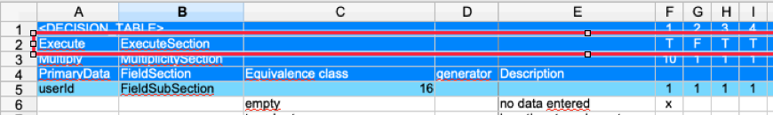
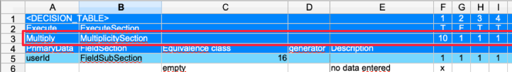
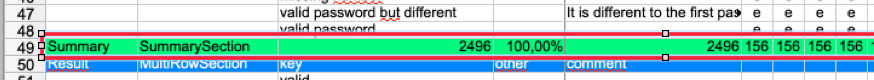

== Sections of an Equivalence Class Table

This section outlines the various sections that can appear in an equivalence class table and their roles.

=== FieldSection
The FieldSection is the primary data section of an equivalence class table. It groups one or more FieldSubSections that contain the relevant test data. Each FieldSection defines the variety of data required for the test, which in turn influences the number of test cases generated.

=== FieldSubSection
A FieldSubSection contains all the equivalence classes for a single field. An equivalence class defines a range or set of input values that are expected to produce equivalent behavior. For example, for a field with a maximum length of 10 characters, all inputs longer than 10 characters might be considered equivalent. Multiple FieldSubSections can exist within a FieldSection, and their values are combined during test case generation.

=== MultiRowSection
MultiRowSections are used to describe additional attributes such as expected results, error messages, or UI actions. They consist of one header row and one or more data rows. Although these sections are not directly manipulated by the test data generator (unlike field sections), their data is accessible to the generators for use in the test cases.

=== TagSection
The TagSection enables users to assign labels or tags to test cases. These tags can later be used for filtering or categorizing test cases. When test cases involve references, the tags from all linked test cases are aggregated for filtering purposes.

=== FilterSection
The FilterSection defines criteria to filter test cases. It is applied only to master test cases—if a test case is referenced, the filter in that referenced test case is not executed. The FilterSection specifies filter processors and corresponding expressions to determine whether a test case meets certain criteria.

=== GeneratorSwitchSection
The GeneratorSwitchSection allows the user to selectively disable specific generators at the test case level. By defining switches, one can control which generators are active during test case creation, allowing for finer control over the generated data.

== Single Row Sections
Single row sections are sections that consist of only one row (typically the header row) and do not support additional data rows. These sections control certain test case properties.

=== ExecuteSection

The ExecuteSection indicates whether a test case should be executed. For example, if the value in the ExecuteSection is set to false (e.g., column "G" shows "F" for test case "2"), that test case will not be executed.

=== NeverExecuteSection
The NeverExecuteSection works in the opposite manner to the ExecuteSection. If a test case is marked in the NeverExecuteSection as true, it is created even if it is referenced by another test case. Conversely, if a test case is referenced and its NeverExecuteSection value is false, the referencing test case may be skipped. Essentially, this section controls the creation of test cases based on references in a way opposite to the ExecuteSection.

=== MultiplicitySection

The MultiplicitySection specifies how many instances of a test case should be created from a single test case definition. For example, if the value in the MultiplicitySection is set to "10" for test case "1" (shown in column "F"), then 10 instances of that test case will be generated.

=== SummarySection

The SummarySection aggregates and displays calculated results for the table. Although it is not used by the generator for creating test cases, it provides valuable feedback to the user by showing totals, percentages, and other summary metrics.

== Additional Model Considerations

* **Internal Representation:**  
  The model uses unique IDs to store test cases, sections, and rows. This design choice facilitates dynamic manipulation (adding, deleting, or reordering elements) but requires careful management of these identifiers in the code.

* **Validation:**  
  Each section and test case includes validation methods to ensure consistency. Common validation checks include ensuring that mandatory fields are not empty, that field names are unique within a section, and that the overall table structure meets required constraints.

* **Flexibility:**  
  The model is designed to support a wide variety of decision tables. Users can define multiple FieldSections, include additional MultiRowSections for extra data, and control test case creation with ExecuteSection, NeverExecuteSection, and MultiplicitySection.

This documentation reflects the current state of the model based on the source code and includes updates to section names and functionality as implemented in the latest version of the software.
